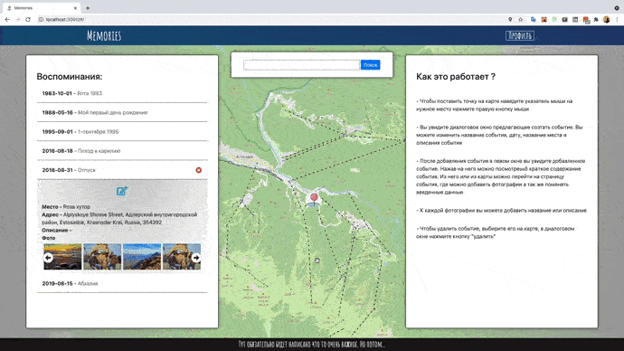

# Memories

## Дневник и фотобанк

### [Ссылка на приложение](https://shellipov.github.io/memories_front)

Приложении для структирирования фотографий и воспоминаний. Можно добавлять события привязывав их к месту на карте, добавить фото, оставлять комментарии о событии или фотографии.

Ссылки на репозитории:

>[front-end repository](https://github.com/shellipov/memories_front) 

>[back-end repository](https://github.com/shellipov/memories_back)

## О приложении

### Карта с воспоминаниями:
  Можно выбрать воспоминание на карте или выбрать из списка.
  Появится диалоговое окно, в котором можно просмотреть событие или перейти на страницу для его подробного просмотра и редактирования

### Добавление:

  На карте нужно поставить точку, справа появится окно для создания события.
  Фотографии можно добавить и удалять на странице событя

### Редактирование:

  Можно оставить свои мысли и воспоминания о событии в целом или о отдельной фотографии

